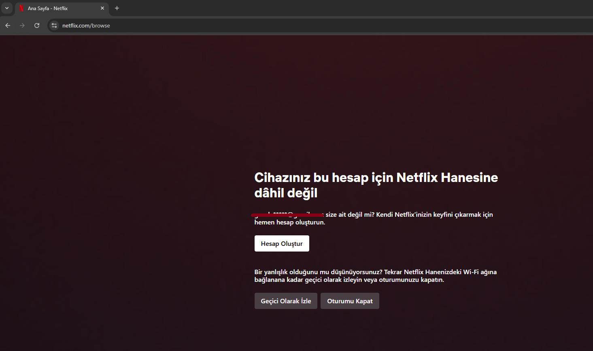
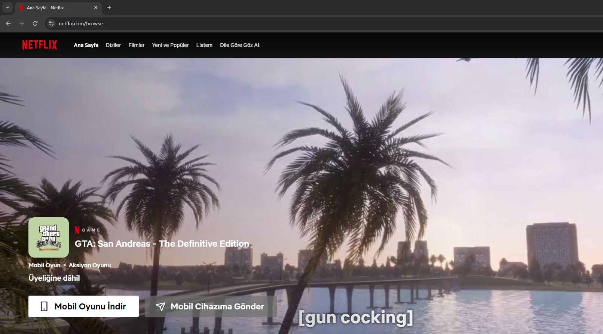

# NetflixRemoveHouseholdPopUp

**Before the Script:**

**After the Script:**

## Introduction

This Script removes the "Your device isn't part of the
Netflix Household for this
account" Popup in Netflix.

## Preface

Although this Script removes the Popup, it will limit the full functionality of Netflix. See [Common Issues](##common-issues).\
To use the functionality, do the disconnecting from the internet trick.\
1. **Open the Video**
2. **Disconnect from the WiFi or unplug your Ethernet cable right before you get the Popup (the video should be played for almost 1 second)**
3. **Your video will continue to play connect back to Wifi or plug your Ethernet cable back in**
\
Now you will have full functionality. This also Works on your phone. Instead of turning off your WiFi enable flight mode and then enter the Netflix app. Choose your Profile. You should be redirected to the homepage. Turn off flight mode and you are good to go!

## Table of Contents

1. [Introduction](#introduction)
2. [Preface](#preface)
3. [Installation](#installation)
4. [Common Issues](#common-Issues)

## Installation

1. **Install Tampermonkey**:
   If you have not already installed Tampermonkey, install it with the provided Links below:
   - [Tampermonkey for Chrome](https://chrome.google.com/webstore/detail/tampermonkey/dhdgffkkebhmkfjojejmpbldmpobfkfo)
   - [Tampermonkey for Firefox](https://addons.mozilla.org/en-US/firefox/addon/tampermonkey/)
   - [Tampermonkey for Edge](https://microsoftedge.microsoft.com/addons/detail/tampermonkey/iikmkjmpaadaobahmlepeloendndfphd)
   - [Tampermonkey for Opera/OperaGX](https://addons.opera.com/en-gb/extensions/details/tampermonkey-beta/)

2. **Install the Script**:
   [Click Here and Press Install](https://www.tampermonkey.net/script_installation.php#url=https://github.com/Glock-Atom/NetflixRemoveHouseholdPopUp/raw/refs/heads/main/Netflix-Bypass-Device-not-in-Household-Popup-2025-02-12.user.js).

3. **Enable the Script**:
   If not already enabled, enable the script by clicking the switch next to the script name in the Tampermonkey Dashboard.

    
## Common Issues

- You can not use Netflix controls (Pause Button, Next episode button, etc.) because of the Popup being removed.

- You can not turn on or off subtitles or voiceovers, again because Netflix controls are not available.

- You can not skip the Video too much or go back too much. This will lead to an error screen. Instead keep skipping with the right arrow button on your keyboard little by little. **You need to allow the buffer to be loaded or else a error screen will pop up.**

## Suggestions/Bug Reports

If you have any suggestions or issues feel free to create issues or pull requests.